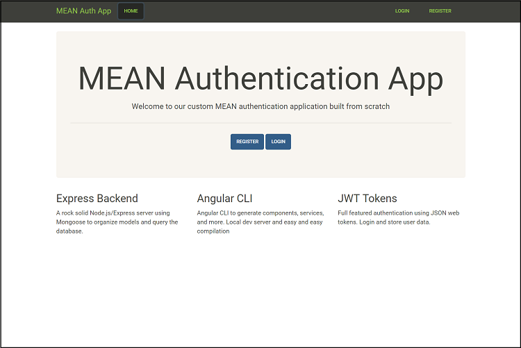

# MEAN Auth App with Angular Universal
This project has been updated with the most recent MEAN versions listed below and has been integrated with **Angular Universal** for SEO and social media compatibility using server-side rendering. The code of this project is a result of my code-along at the end of part 9 of the video series [MEAN Stack Front to Back](https://www.youtube.com/watch?v=uONz0lEWft0&list=PLillGF-RfqbZMNtaOXJQiDebNXjVapWPZ) by *Brad Traversy*.  His original code repo may be found [here](https://github.com/bradtraversy/meanauthapp).  Instructions on how to deploy this code to Heroku are also included.

<p align="center">
    <br>
    <a href="https://rocky-harbor-15925.herokuapp.com/">Mean Auth App with Angular Universal</a>
</p>

## Versions Used
This project was generated with [Angular CLI](https://github.com/angular/angular-cli) version 1.6.2.
* MongoDB v3.6.0
* Express v4.16.2
* Angular v5.0.0
* Node.js v9.3.0

## Starting the Project
To begin working with this project, perform the following tasks:

1. Clone this repository to your local machine
2. Start up your local instance of MongoDB
3. Run `npm install` to download dependencies
4. Run `npm start` to generate the */dist* folder for your Angular front-end, the */dist-server* folder for Angular Universal, and to start your Node.js server on `http://localhost:3000/`.

## Development server
Run `ng serve` for a dev server. Navigate to `http://localhost:4200/`. The app will automatically reload if you change any of the source files.  Please note that this will not start your MongoDB connection.

# Code Updates to Original Project
The original project by [Brad Traversy](https://www.youtube.com/user/TechGuyWeb) was filmed in late Febuary 2017 with Angular 2.  Since that time, there have been numerous code-breaking changes, especially with the release of Angular 5 in early November 2017.  Hopefully, this repository will help others code-along to this outstanding video series more easily.

## Back-End Updates [Parts 1 - 4]
The following changes should be made to your code when developing your back-end.  Most of these updates reflect changes to third-party packages such as Passport.js, bcrpyt, and mongoose.

* Bluebird promise library (`npm install bluebird`) used with mongoose to addresss deprecation warning in `app.js` (named `server.js` in this repo).
    ```javascript
    // Connect to database via mongoose 
    mongoose.Promise = require('bluebird');
    mongoose.connect(config.database, { useMongoClient: true, promiseLibrary: require('bluebird') })
        .then(() => console.log(`Connected to database ${config.database}`))
        .catch((err) => console.log(`Database error: ${err}`));
    ```

* Use `{data: user}` in the `jwt.sign()` method in `users.js`
    ```javascript
    User.comparePassword(password, user.password, (err, isMatch) => {
        if(err) throw err;
        if(isMatch) {
            const token = jwt.sign({data: user}, config.secret, {
    ```

* Use `Bearer ${token}` (make sure to include the space) in the `User.comparePassword()` method in `users.js`
    ```javascript
    res.json({ 
        success: true, 
        token: `Bearer ${token}`,
        user: {
            id: user._id,
            name: user.name,
            username: user.username,
            email: user.email
        }
    ```

* Use `ExtractJwt.fromAuthHeaderAsBearerToken()` method in `passport.js`
    ```javascript
    module.exports = (passport) => {
        let opts = {};
        opts.jwtFromRequest = ExtractJwt.fromAuthHeaderAsBearerToken();
    ```

* Use `jwt_payload.data._id` as the argument to the `User.getUserById` method in `passport.js`
    ```javascript
    passport.use(new JwtStrategy(opts, (jwt_payload, done) => {
            User.getUserById(jwt_payload.data._id, (err, user) => {
    ```

* Nested callback functions have been converted to Promises (optional - example shown below)
    ```javascript
    module.exports.addUser = function(newUser, callback){
        bcrypt.genSalt(10, (err, salt) => {
            bcrypt.hash(newUser.password, salt, (err, hash) => {
                if(err) throw err;
                newUser.password = hash;
                newUser.save(callback);
            });
        });
    }
    ```
    becomes 

    ```javascript
    module.exports.addUser = (newUser, callback) => { 
        bcrypt.genSalt(10)
            .then((salt) => bcrypt.hash(newUser.password, salt))
            .then((hash) => {
                newUser.password = hash;
                newUser.save(callback);
            }).catch((err) => console.log('There was an error adding a user.'));
    }
    ```

## Front-End Updates [Parts 5 - 9]
The code in this section mainly focuses on building the front-end with Angular.  This project has been integrated with Angular Universal for server side rendering and because of this, there have been several changes to the original code for compatibility reasons in addition to various UI changes.  **It's also important to note that the code in this repo is structured differently than in the video series, but the updated changes can be used in your own code-along projects.**

### Forms
* Import `FormsModule` into `app.module.ts`
    ```javascript
    import { FormsModule } from '@angular/common/http';
    ...
    ...
    imports: [
        BrowserModule.withServerTransition({ appId: 'serverApp' }), // BrowserModule if not using Angular Universal
        FormsModule,
        HttpClientModule,
        RouterModule.forRoot(appRoutes),
    ],
    ```

* Template-Driven Forms are used to implement forms in the `register.component` and `login.component` files (example below).
    ```
    <form #loginForm="ngForm" (ngSubmit)="onLoginSubmit(loginForm)">
        <div class="form-group">
            <label for="username">Username <sup class="red">*</sup></label>
            <input required name="username" id="username" #username="ngModel" ngModel type="email" class="form-control">
        </div>
    ...
    ```

* Validation used with `*ngIf` directive instead of `angular2-flash-messages` since this package was not compatible with Angular Universal.  Code adapted to continue to validate for all fields required and an appropriate e-mail input just as in the original video.  The only difference is that the flash messages do not disappear, but the functionality of each webpage was adapted to accomodate for this (example below).
    ```
    <h2 class="page-header">Register</h2>
    <div class="alert alert-danger" *ngIf="errSwitch" role="alert">{{ errMsg }}</div>
    <div class="alert alert-success" *ngIf="succSwitch" role="alert">{{ succMsg }}</div>
    ```

### HTTP Client
`HTTPClient` is used to connect our HTTP API endpoints as the old `Http` API used in the video series has been deprecated in Angular 5.  The following syntax changes should be made in order to properly connect your back-end APIs.

* Import `HTTPClientModule` into `app.module.ts`
    ```javascript
    import { HttpClientModule } from '@angular/common/http';
    ...
    ...
    imports: [
        BrowserModule.withServerTransition({ appId: 'serverApp' }), // BrowserModule if not using Angular Universal
        FormsModule,
        HttpClientModule,
        RouterModule.forRoot(appRoutes),
    ],
    ```

* Import `HTTPClient` into files when using the client
    ```
    import { HttpClient } from '@angular/common/http';
    ```

* JSON is an assumed default and no longer needs to be explicitly parsed (example from `registerUser(user)` function in `auth.service.ts`).
    ```javascript
    return this.http.post('http://localhost:3000/users/register', user, { headers })
        .map(res => res.json());
    ```

    becomes

    ```javascript
    return this.http.post('http://localhost:3000/users/register', user, { headers });
    ```

* Subscribe to observables as usual, but to avoid a pre-compilation error for `data.success`, set the `data` argument to type `any` (example from `login.component.ts`).
    ```javascript
    this.authService.authenticateUser(user).subscribe((data: any) => {
        if (data.success) {
            this.authService.storeUserData(data.token, data.user);
            this.router.navigateByUrl('/dashboard');
    ```

* `HTTPHeaders` has replaced the deprecated `Headers` API. HTTPHeaders are immutable so after importing them from `@angular/common/http`, they must be explicitly appended to the defined header itself.  HTTPHeaders are used in `auth.service.ts`.
    ```javascript
    getProfile() {
        this.loadToken();
        let headers = new HttpHeaders();
        headers.append('Content-Type', 'application/json');
        headers.append('Authorization', this.authToken);
        return this.http.get('http://localhost:3000/users/profile', { headers });
    }
    ```
    
    becomes

    ```javascript
    getProfile() {
        this.loadToken();
        let headers = new HttpHeaders();
        headers = headers.append('Content-Type', 'application/json');
        headers = headers.append('Authorization', this.authToken);
        return this.http.get('http://localhost:3000/users/profile', { headers });
    }
    ```

### Other
* The `tokenNotExpired()` function was not implemented since the `Angular2-jwt` package was not compatibile with Angular Universal.  Instead, a simple workaround was implemented, which unfortunately does not save the user's application state after exiting the browser window.
    ```javascript
    loggedIn() {
        if (this.authToken) {
        return true;
        } else {
        return false;
        }
    }
    ```

    If you are not using Angular Universal, `id_token` should be set as an argument for `tokenNotExpired()`
    ```javascript
    loggedIn() {
        tokenNotExpired(id_token);
    }
    ```

* `NotFoundComponent` added to `app.module.ts` to catch all Error: 404 - Page Not Found routes in Angular.  There is a separate error handler for 404s with API requests in `server.js`
    ```javascript
    const appRoutes: Routes = [
    { path: '', component: HomeComponent },
        ...
        ...
    { path: '**', component: NotFoundComponent }
    ];
    ```

* Class for fade-in animation added for each page transition in `styles.css` (optional)
    ```css
    .fadein {
        -webkit-animation: fadein 1s; /* Safari, Chrome and Opera > 12.1 */
            -moz-animation: fadein 1s; /* Firefox < 16 */
            -ms-animation: fadein 1s; /* Internet Explorer */
                -o-animation: fadein 1s; /* Opera < 12.1 */
                animation: fadein 1s;
    }

    @keyframes fadein {
        from { opacity: 0; }
        to   { opacity: 1; }
    }
    ...
    ```

# Deploying to Heroku
This code may be deployed to Heroku and connected to mLab making it accessible on the internet.  This guide has been slightly modified from [Part 10](https://www.youtube.com/watch?v=cBfcbb07Tqk&t=1s) of the video series as this code has been structure differently.

1. Set up mLab by modifying `config/database.js` as directed in [Part 10](https://www.youtube.com/watch?v=cBfcbb07Tqk&t=1s)
2. Modify `registerUser(user)`, `authenticateUser(user)`, and `getProfile()` functions in `auth.service.ts` to connect to mLab (example below)
    ```javascript
    registerUser(user) {
        user.username = user.username.toLowerCase();
        let headers = new HttpHeaders();
        headers = headers.append('Content-Type', 'application/json');
        return this.http.post('http://localhost:3000/users/register', user, { headers });
    }
    ```
    becomes
    ```javascript
    registerUser(user) {
        user.username = user.username.toLowerCase();
        let headers = new HttpHeaders();
        headers = headers.append('Content-Type', 'application/json');
        return this.http.post('users/register', user, { headers });
    }
    ```
3. Modify the `start` and `postinstall` scripts in `package.json` to:
    ```json
    "scripts": {
        "ng": "ng",
        "start": "node server.js",
        "build": "ng build",
        "test": "ng test",
        "lint": "ng lint",
        "e2e": "ng e2e",
        "postinstall": "ng build --prod && ng build --prod --app universal --output-hashing=none"
    },
    ```
4. Move the following dependecies from `devDependencies` to `dependencies` in `package.json`:
    ```json
    "dependencies": {
        ...
        "@angular/cli": "1.6.2",
        "@angular/compiler-cli": "^5.0.0",
        ...
        "typescript": "~2.4.2",
        ...
    },
    ```
5. Deploy to Heroku as directed in [Part 10](https://www.youtube.com/watch?v=cBfcbb07Tqk&t=1s).

# Further help
To get more help on the Angular CLI use `ng help` or go check out the [Angular CLI README](https://github.com/angular/angular-cli/blob/master/README.md).
